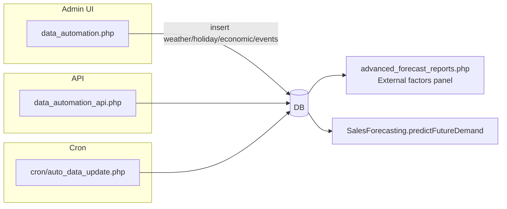

# PST – Point of Sale, Inventory & Forecasting Suite

A PHP-based system for Pastil sa Tabi operations that includes:
- POS and inventory management for Admin/Cashier/Inventory roles
- Kitchen Display System (KDS)
- Advanced demand forecasting with real external factors (weather/holidays/economics/events)
- Forecast validation and performance dashboards

## Tech Stack
- PHP 8+
- MariaDB/MySQL
- Front-end: HTML/CSS/JS, Chart.js
- Sessions for authentication; role-based areas (admin, cashier, inventory)

## Project Structure (high-level)
```
PST/
├─ Database/
│  └─ pst.sql
├─ PSTsystem/
│  ├─ admin/
│  ├─ cashier/
│  ├─ customer/
│  ├─ inventory/
│  │  ├─ api/
│  │  ├─ classes/
│  │  │  ├─ SalesForecasting.php
│  │  │  └─ ForecastValidation.php
│  │  ├─ cron/
│  │  ├─ assets/, partials/
│  │  ├─ advanced_forecast_reports.php
│  │  ├─ forecast_reports.php
│  │  ├─ forecast_performance.php
│  │  ├─ data_automation.php
│  │  └─ ...
│  └─ kds/
│     ├─ api/
│     └─ index.php
├─ phpmailer/
└─ README.md
```

## Database
- Import `Database/pst.sql` into MySQL/MariaDB.
- Includes POS tables (`rpos_products`, `rpos_orders`, …) and external factors:
  - `rpos_weather_data`, `rpos_holiday_data`, `rpos_economic_data`, `rpos_local_events`
  - Forecast support: `rpos_forecast_history`, `rpos_forecast_validations`, `rpos_restocking_recommendations`

## Configuration
- Update DB credentials in `PSTsystem/*/config/config.php` and/or `pdoconfig.php`.
- Optional system settings in `rpos_system_config` (e.g., weather location/provider).

## Run Locally
1. Start Apache + PHP + MySQL (e.g., XAMPP).
2. Clone into web root, e.g. `C:\xampp\htdocs\PST`.
3. Import `Database/pst.sql`.
4. Update DB config files.
5. Visit: `http://localhost/PST/PSTsystem/inventory/` (or `admin/`, `cashier/`).

## Key Features

### Sales Forecasting (real data)
- File: `inventory/classes/SalesForecasting.php`
- Historical sales (charts + forecasts) include only: Paid, Preparing, Ready, Completed.
- Core methods:
  - `getHistoricalSales($product_id, $days)` – aggregates `rpos_orders` daily; handles mirror/combo links.
  - `predictFutureDemand($product_id, $days)` – moving average + exponential smoothing + trend + seasonal + external factors.
  - `validateForecastAccuracy($product_id, $days)` – MAE/MSE/RMSE/MAPE/Bias + rating.
- External factor helpers for UIs:
  - `getRealWeatherDataPublic()`, `getRealHolidayDataPublic()`, `getRealEconomicDataPublic()`, `getRealLocalEventsDataPublic()`

### Advanced Forecast Reports
- File: `inventory/advanced_forecast_reports.php`
- Product selection, horizon filter (7–90 days)
- Historical & future charts (Chart.js)
- External Factors Impact Analysis uses:
  - `rpos_weather_data` (condition + impact)
  - `rpos_holiday_data` (name + impact)
  - Latest `rpos_economic_data` up to date (impact + indicators)
  - `rpos_local_events` averaged per date (impact + titles)
- Forecast validation card (MAPE, rating)

### Forecast Reports (Overview)
- File: `inventory/forecast_reports.php`
- Overview doughnut + critical items
- Enhanced charts: 90-day sales with 7-day MA; future demand with confidence band

### Forecast Performance Dashboard
- File: `inventory/forecast_performance.php`
- Shows avg accuracy (7/14/30 days) and per-product ratings
- “Recalculate & Save” persists validations to `rpos_forecast_validations`

### External Data Automation
- Class: `inventory/classes/DataAutomation.php`
- Admin UI: `inventory/data_automation.php`
- API: `inventory/api/data_automation_api.php` (key protected)
- Cron: `inventory/cron/auto_data_update.php` (+ Windows `.bat` helper)

### Kitchen Display System (KDS)
- File: `kds/index.php`
- Live board; status flow Pending → Preparing → Ready → Completed
- “Start Preparing” disabled for Pending; enabled for Paid

## APIs (samples)
- External factors: `inventory/api/external_factors.php`
- Data automation: `inventory/api/data_automation_api.php`
- KDS: `kds/api/get_orders.php`, `kds/api/update_order_status.php`

## Troubleshooting
- No historical sales: ensure orders exist for the product in allowed statuses and within lookback.
- Weather SQL: escape column `condition` as `condition`.
- Blank charts: confirm DB import and configs.

## Automation
- Linux cron: `php inventory/cron/auto_data_update.php`
- Windows Task Scheduler: run `inventory/cron/run_data_automation.bat`

## Notes
- Product links (`rpos_product_links`) define mirror/combo relationships for sales/stock.
- Restocking recommendations combine EOQ, reorder points, and forecast outcomes.

## System Flowcharts (Mermaid)

### Order lifecycle (Cashier → KDS → Completion)
```mermaid
flowchart LR
  A[Customer places order (Cashier)] --> B{Order status}
  B -->|Pending / Paid| C[Persist to rpos_orders]
  C --> D[API: KDS get_orders.php]
  D --> E[KDS Board shows cards]

  E -->|Paid → Start Preparing| F[API: update_order_status.php -> Preparing]
  E -->|Pending| F_disabled[Start Preparing disabled]

  F --> G[Kitchen prepares]
  G -->|Mark Ready| H[API: update_order_status.php -> Ready]
  H -->|Complete Order| I[API: update_order_status.php -> Completed]
  I --> J[Inventory logs / reports update]
```

### Forecasting data flow (real data)
```mermaid
flowchart LR
  subgraph DB[Database]
    O[rpos_orders]
    P[rpos_products]
    L[rpos_product_links]
    W[rpos_weather_data]
    H[rpos_holiday_data]
    E[rpos_economic_data]
    V[rpos_local_events]
    FH[rpos_forecast_history]
    FV[rpos_forecast_validations]
  end

  A[SalesForecasting.getHistoricalSales] -->|joins| O
  A --> L
  A --> P
  B[SalesForecasting.predictFutureDemand] --> A
  B --> W
  B --> H
  B --> E
  B --> V
  B --> FH[Store forecast (optional)]

  UI1[advanced_forecast_reports.php] --> B
  UI1 --> A
  UI1 --> EF[External Factors Impact Analysis\n(reads W,H,E,V)]
```

### External factors automation


### Forecast validation and performance
```mermaid
flowchart LR
  SFH[SalesForecasting.getHistoricalSales] --> VAL1[ForecastValidation.calculateAccuracy]
  VAL1 -->|compare daily| METRICS[MAE/MSE/RMSE/MAPE/Bias/Accuracy]
  VAL1 --> FV[rpos_forecast_validations (store)]
  PERF[forecast_performance.php] --> VAL1
  PERF --> FV
  PERF --> CHARTS[Performance charts & per-product ratings]
```

### Inventory forecast overview
```mermaid
flowchart LR
  ALL[getAllProductForecasts] --> GEN[generateRestockingRecommendations]
  GEN --> SFp[SalesForecasting.predictFutureDemand]
  GEN --> STOCK[getEffectiveStock + thresholds]
  GEN --> KPIs[days_until_stockout, EOQ, reorder_point]
  UI2[forecast_reports.php] --> ALL
  UI2 --> CH1[Doughnut: critical/warn/normal]
  UI2 --> CH2[Historical (90d) + MA(7)]
  UI2 --> CH3[Future demand + confidence band]
```
